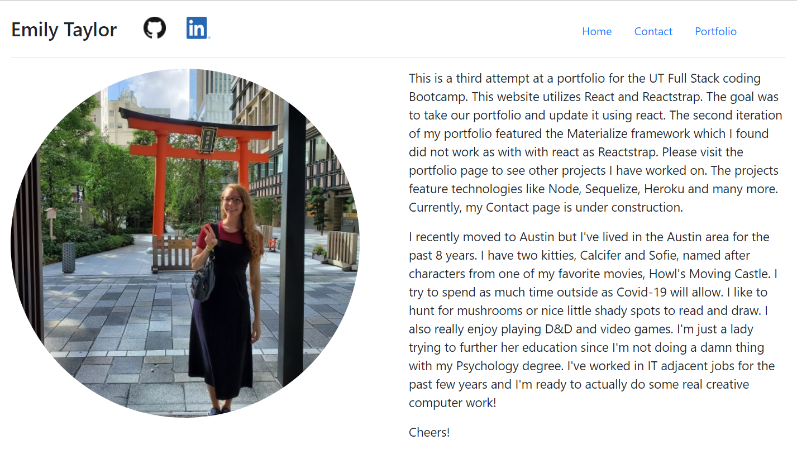
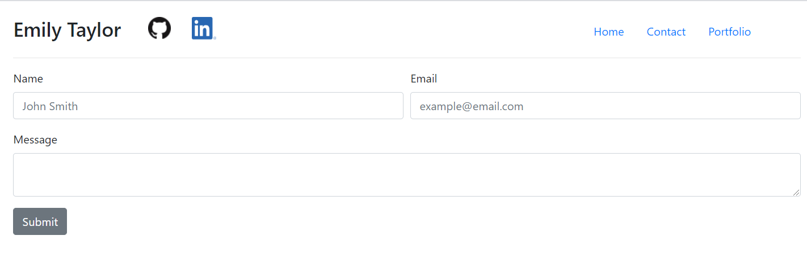
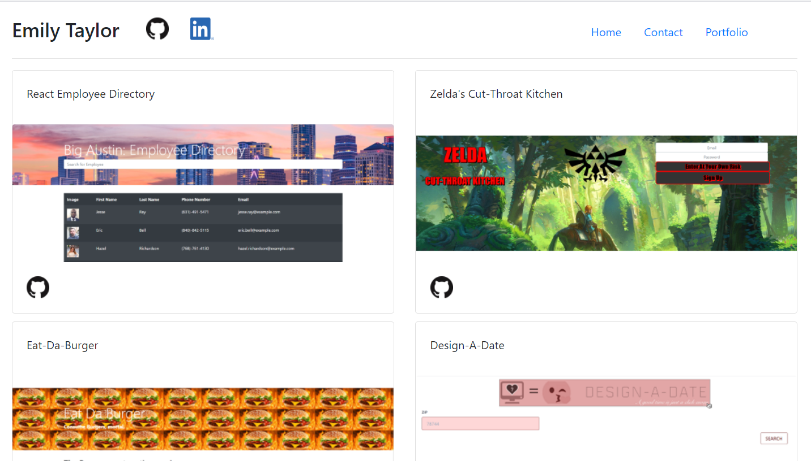

This project was bootstrapped with [Create React App](https://github.com/facebook/create-react-app).

# react_portfolio
https://emilyporterfieldtaylor.github.io/react_portfolio/

## Description  
This updated portfolio was created with React and Reactstrap. I kept it pretty simple for a minimalist feel. I will continue to use the second iteration of my portfolio just because I like the way it looks better. I tried to use Materialzize on this project as well but it didn't play with React as nicely as Reactstrap.

## Home Screen

## Contact Screen

## Portfolio Screen

    
## Table of Contents

  *[Installation](#installation)
  *[Usage](#usage)
  *[License](#license)
  *[Contribution](#contribution)
  *[Questions](#questions)
    
## Installation
npm i

To install necessary dependencies, run the following command:

--
npm i
--

--
npm start
--
    
## License
Creative Commons

    
## Contributing
https://github.com/emilyporterfieldtaylor/react_portfolio

## Questions

​
If you have any questions about the repo, open an issue or contact https://github.com/emilyporterfieldtaylor
